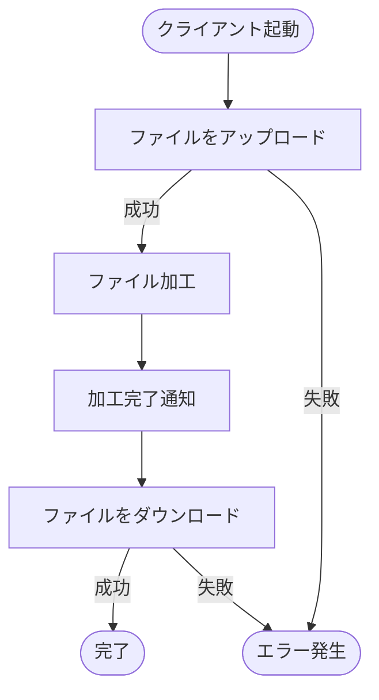
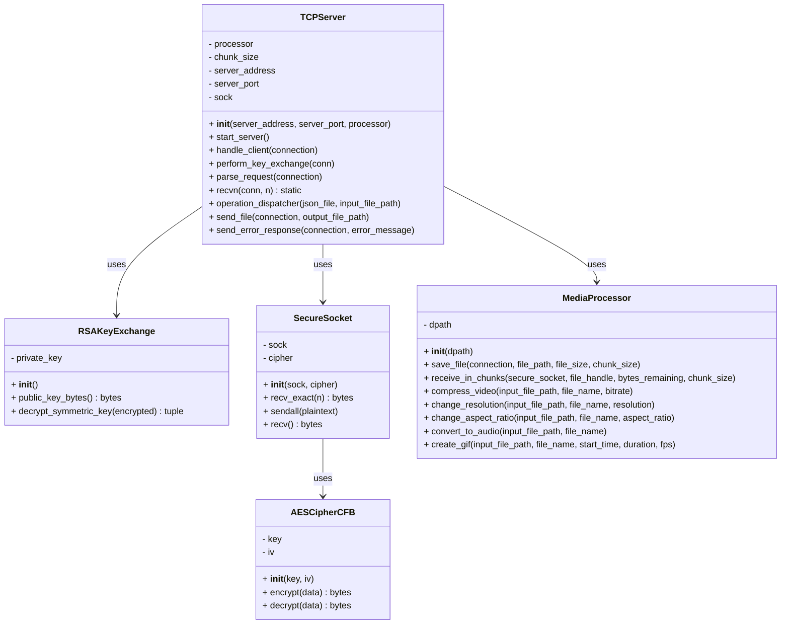
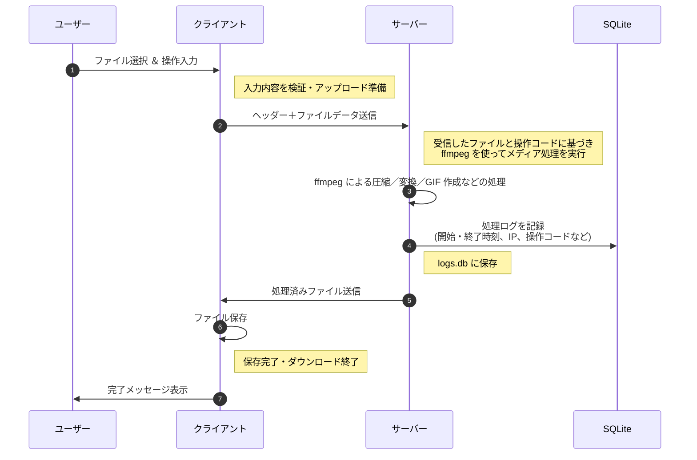

# Video Processor 


 


[](./LICENSE)


<br>

### 動画をアップロードすると、暗号通信 と FFmpeg処理 で安全に変換できるPythonシステム

### フレームワークなしで、プロトコル・暗号・変換処理をゼロから実装

<br>

## ⭐ デモ動画

<br>

### 動画のアスペクト比を変更するデモ動画

<br>


<br>


<br>

## **📝 サービス紹介と導入ガイド**
- [サービスの特徴・開発の目的](#サービスの特徴・開発の目的)

- [セットアップ手順](#セットアップ手順)

- [基本的な使い方](#基本的な使い方)

<br>

## **🛠 技術構成**
- [使用技術](#使用技術)

- [クラス図](#クラス図)

- [システム全体の構成図](#システム全体の構成図)

<br>

## **💡 開発の振り返りと展望**
- [設計上のこだわり](#設計上のこだわり)

- [苦労した点](#苦労した点)

- [大規模化への方針](#追加予定の機能)

<br>

## **📚 出典・ライセンス**

- [参考文献](#参考文献)

- [ライセンス情報](#ライセンス)

<br>

---

## <a id="サービスの特徴・開発の目的"></a> 📝 サービスの特徴・開発の目的

<br>

###  サービスの全体像

- このプロジェクトは、**動画変換サービス**です。

- ユーザーは動画をサーバにアップロードし、その動画に対して行いたい処理を指定すると、<br>

  サーバから処理が完了した動画が返されます。


<br>

### できること

- **動画圧縮**
  
  指定したビットレートでサイズを軽量化

- **解像度変更**
  
  フルHD、HD、SDなどに変換

- **アスペクト比変更**
  
  16:9、4:3、1:1などに調整

- **音声抽出**
  
  動画から音声ファイルだけを取り出して保存

- **GIF作成**
  
  動画の好きな部分を切り取り、GIFアニメーションを作成

<br>

### 作成のきっかけ

1. **課題意識**

    動画処理やファイル転送の仕組み、プロトコルを自作して、動画処理や、通信処理、UIの構築を学ぶため

2. **解決アプローチ**

   `TCPソケット通信`や`FFmpeg制御`、`独自プロトコル`、`Streamlit`によってメディア変換サービスを構築

3. **得られた学び**


   ファイルの送受信や動画の加工、暗号通信がどう動いているかを仕組みから理解した

<br>

---

## <a id="セットアップ手順"></a> 🚀 セットアップ手順

<br>

### 1. 前提条件 

以下を事前にインストールしてください

- [Git](https://git-scm.com/)

- [Docker](https://docs.docker.com/get-docker/)

<br>

### 2. リポジトリのクローン

以下のコマンドをターミナルで実行します

```bash
git clone https://github.com/BackendExplorer/Video-Processor.git
```

```bash
cd Video-Processor
```

<br>

---


## <a id="基本的な使い方"></a>🧑‍💻 基本的な使い方

<br>

### 1. コンテナ起動

Docker Desktopを起動したら、ターミナルを開いて、以下のコマンドでコンテナを起動します。


```bash
docker-compose up
```

<br>


http://localhost:8501 でアクセス可能です。

<br>


### 2. ユーザーの操作手順

<br>

以下の手順で動画を変換できます。

<br>




<br>

### 3. ログの確認

<br>

docker-compose.ymlがあるフォルダで、以下のコマンドを実行するとログを表示できます

```bash
docker compose exec db sqlite3 /data/logs.db "SELECT * FROM logs ORDER BY id DESC;"
```

<br>

| 項目名           | 説明                                              |
|------------------|---------------------------------------------------|
| `id`             | ログの通し番号
| `timestamp_start`| 処理の開始時刻
| `timestamp_end`  | 処理の終了時刻
| `client_ip`      | クライアントのIPアドレス|
| `operation_code` | 実行された処理の種類（例：1=圧縮、3=アスペクト比変更）|
| `file_name`      | 処理対象のファイル名                              |
| `file_size`      | 処理対象のファイルサイズ（バイト単位）            |
| `media_type`     | ファイルの拡張子（例：.mp4、.gif、.mp3など）       |


<br>


<br>

---

## <a id="使用技術"></a>🧰 使用技術

<br>

### 技術選定の理由

- **`Python`**
  
  豊富な標準ライブラリと高い可読性によって、複雑なシステムを効率的に実装するため
  
- **`TCPソケット`**
  
  ファイル転送において信頼性と順序保証が必要なため

- **`ハイブリッド暗号方式`**

  安全性を確保しつつ、素早いデータ転送をするため

- **`ffmpegライブラリ`**
  
  動画圧縮・解像度変更・音声抽出・GIF作成などを行うため

- **`Streamlit`**

  Pythonのみで手軽にWeb UIを構築できるため、開発効率を重視して採用

- **`Docker`**

  依存関係をコンテナ内に隔離し、環境差異を排除してどこでも同じ動作を保証するため

- **`Docker-Compose`**

  サーバコンテナとクライアントコンテナを同時に起動し、起動手順を簡素化するため

- **`Github Actions`**

  プッシュやプルリクエスト時に、Docker Buildxによるビルドから起動・動作確認・クリーンアップを

  自動化し、変更によって生じた不具合を素早く検出・修正できるようにするため


<br><br>

| カテゴリ       | 技術スタック                                                                 |
|----------------|------------------------------------------------------------------------------|
| 開発言語       |  <br>標準ライブラリ：`socket`, `os`, `json`, `logging`, `pathlib`, `sys`, `re` |
| 通信技術       |  <br>TCPソケットによるファイル送受信 |
| 暗号技術       |  <br>ハイブリッド暗号方式 (RSA＋AES) で通信
| メディア加工   |  <br>`ffmpeg` ライブラリをPythonから呼び出して動画・音声処理 |
| UIフレームワーク |  <br>Webベースのインターフェースを簡易に構築 |
| 開発環境       | &nbsp;&nbsp;&nbsp;&nbsp; |
| バージョン管理 | &nbsp;&nbsp;&nbsp;&nbsp; |
| インフラ |    |
| 描画ツール     | &nbsp;&nbsp;&nbsp;&nbsp; |

<br>

---


## <a id="クラス図"></a>📌 クラス図

<br>

### <a id="server.py のクラス図"></a> [サーバプログラム](https://github.com/BackendExplorer/Video-Processor/blob/main/server.py) のクラス図

<br>


<br>

- **課題点**

  サーバーでは、クライアントとの通信、暗号処理、動画変換といった処理が混在しており、
  
  コードの保守性や可読性が低く、機能追加時の影響範囲も広がりやすい問題がありました。

<br>

- **解決アプローチ**

  処理ごとにクラスを分離し、通信は `TCPServer`、
  
  暗号は `RSAKeyExchange` / `AESCipherCFB`、
  
  動画処理は `MediaProcessor` に責務を明確化しました。

<br>

- **得られた成果**

  各処理が独立して管理できるようになり、コードの見通しが大幅に改善。
  
  保守性・拡張性が向上し、機能追加のコストも削減できました。


<br>

### <a id="server.py のクラス図"></a> 


---

## <a id="システム全体の構成図"></a>🔄 システム全体の構成図

<br>



<br>


<br>

---
## <a id="設計上のこだわり"></a>🌟 設計上のこだわり

<br>

- **プロトコル仕様**

  以下は、動画転送のために設計された

  独自プロトコル MMP （Multiple Media Protocol) のパケット構造を表します。

<br>


<br>

- **課題点**

  動画・音声・JSONなど異なる種類のデータを送受信する際、
  
  ファイルの境界や構造が不明確だと、受信側の解析処理が複雑になりやすく、
  
  処理の信頼性や拡張性にも課題がありました。

<br>

- **解決アプローチ**

  ヘッダーに `JsonSize（2B）`、`MediaTypeSize（1B）`、`PayloadSize（5B）` を固定長で格納し、
  
  その後に Json部・MediaType部・Payload部をこの順で送る独自プロトコル（MMP）を設計しました。
  
  これにより、受信側は常に先頭8バイトを読むだけで、各データの位置と長さを正確に把握できます。

<br>

- **得られた成果**

  データの種類や構造が明確になり、受信処理を簡素化。
  
  異なるメディア形式にも柔軟に対応できるようになり、

  将来的な機能追加やプロトコルの拡張にも対応しやすくなりました。

<br>

---
## <a id="苦労した点"></a> ⚠️ 苦労した点

<br>

### 安全なファイル送受信のための暗号化通信の設計

<br>

- **課題点**
  
  メディアファイルをクライアントとサーバー間でやり取りするにあたり、<br>
  
  通信の盗聴や改ざんを防ぐ必要がありました。しかし、暗号化通信の仕組みを自前で実装するには、<br>
  
  RSA や AES などの暗号技術とソケット通信の両方の知識が必要で、設計に苦労しました。

<br>

- **解決アプローチ**

  最初に RSA で公開鍵をサーバーからクライアントに送り、<br>

  クライアント側で AES 鍵と初期化ベクトル（IV）を生成し、それを RSA で暗号化してサーバーに送信。<br>

  以降の通信は AES（CFBモード）による共通鍵暗号化通信に切り替えることで、<br>

  安全かつ効率的に大容量ファイルを送受信できるようにしました。

<br>
    
- **得られた成果**

  通信の安全性を確保しながら、ファイルサイズに関係なくスムーズな送受信が実現できました。<br>
  
  また、自前で暗号化通信を構築したことで、<br>

  低レイヤのネットワーク処理や暗号技術への理解が深まったことも大きな収穫でした。
  
<br>

---

## <a id="追加予定の機能"></a> 🔥 大規模化への方針

<br>

### システムの大規模化にあたっては、以下の3段階でアクセス増加に備えます。

<br>

1. **垂直スケーリング**

    処理能力を高めるためにCPUの性能を上げたり、キャッシュを増やすためにメモリを追加し、

    より多くのデータを保存するためにストレージを増やします。

<br>

2. **水平スケーリング**

    垂直スケーリングにおける物理的なハードウェアの限界を突破するために、

    サーバの数を増やします。このとき、各サーバーをノードと呼びます。

<br>

3. **ロードバランサー**
  
    ユーザーからのすべての通信は、まずロードバランサーノードに集約され、

    そこから適切なサーバノードに自動振り分けされます。

<br>

---

## <a id="参考文献"></a>📗 参考文献

<br>

### 公式ドキュメント

- [Python socket - ソケット通信](https://docs.python.org/3/library/socket.html)

  TCP・UDP通信の基本構文と使い方を参照

- [Python FFmpeg - 動画処理](https://ffmpeg.org/documentation.html)

  アップロードした動画に指定した処理を行うために参照

- [Python threading - マルチスレッド](https://docs.python.org/3/library/threading.html)

  マルチスレッド処理（Thread の生成・開始・join）を実装するために参照

- [PyCryptodome — RSA (PKCS1_OAEP)](https://pycryptodome.readthedocs.io/en/latest/src/cipher/oaep.html)

  RSA公開鍵暗号の暗号化・復号化の仕組みを理解するために参照

- [PyCryptodome — AES (CFBモード)](https://www.pycryptodome.org/)

  共通鍵暗号方式によるデータの暗号化のために参照

- [Streamlit](https://docs.streamlit.io/)

  GUIを迅速に実装するために参照


<br>

### 参考にしたサイト

- [Pythonによるソケット通信の実装](https://qiita.com/t_katsumura/items/a83431671a41d9b6358f)

- [暗号化アルゴリズムの基本と実装をPythonで詳解](https://qiita.com/Leapcell/items/946a00fa060119f67444)

- [みんなが欲しそうなDockerテンプレートまとめ](https://qiita.com/ryome/items/ab23eeadf3c2ff6b35bd)


<br>

---

## <a id="ライセンス"></a>📜 ライセンス情報

<br>

<ul>
  <li>
    本プロジェクトの全コード・構成・図・UIなどの著作権は、制作者である Tenshin Noji に帰属します。<br><br>
    採用選考や個人的な学習を目的とした閲覧・参照は歓迎しますが、<br><br>
    無断転載・複製・商用利用・二次配布は禁止とさせていただきます。<br><br>
    ライセンス全文はリポジトリ内の <a href="./LICENSE.md" target="_blank">LICENSEファイル</a>をご覧ください。
  </li>
</ul>

<br>
