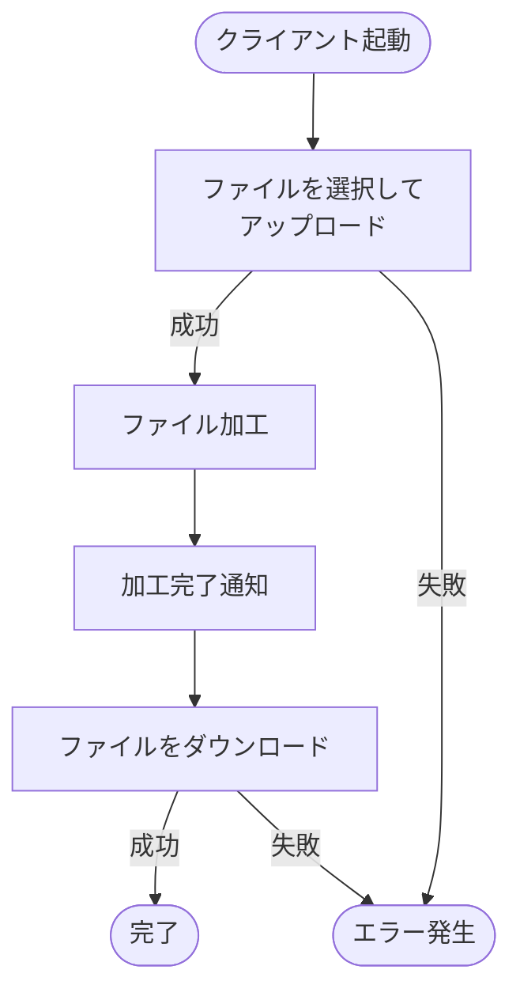
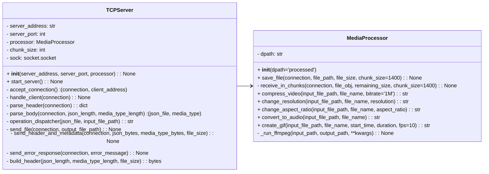
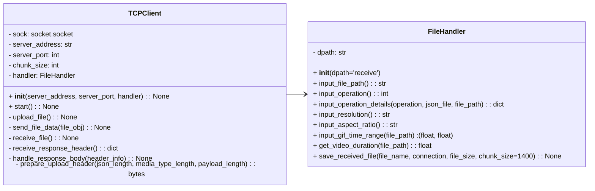
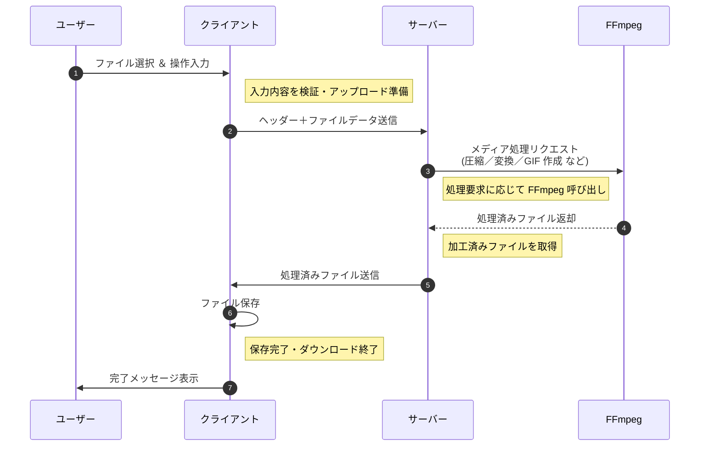

<ul>
  <li><h3>エレクトロンによるデスクトップアプリ化</h3></li>
  <li><h3>テストコードの導入</h3></li>
  <li><h3>UIの国際化対応</h3></li>
</ul>


# 🎥  Video-Processor  ✨


### TCP と 独自プロトコル による動画処理サービス

<br>

## 🖥 デモ

<br>

**動画のアスペクト比を変更するデモ動画**

<br>

https://github.com/user-attachments/assets/9741fc4e-e8c4-46ab-ac5b-aca6d685881a

<br>


## **📝 概要**
- [説明](#説明)

- [セットアップ](#セットアップ)

- [使い方](#使い方)

<br>

## **🛠 技術関連**
- [使用技術](#使用技術)

- [クラス図](#クラス図)

- [処理の流れ](#処理の流れ)

<br>

## **💡 開発のポイント**
- [こだわりのポイント](#こだわりのポイント)

- [苦労した点](#苦労した点)

- [さらに追加したい機能](#さらに追加したい機能)

<br>

## **📚 参考情報・ライセンス**
- [参考文献](#参考文献)

- [ライセンス](#ライセンス)

<br>

---

## <a id="説明"></a> 📝 説明

このプロジェクトは、**動画変換サービス**です。

ユーザーは動画をサーバにアップロードし、その動画に対して行いたい処理を指定すると、

サーバから処理が完了した動画が返されます。


<br>

### できること

- **動画圧縮**
  
  指定したビットレートでサイズを軽量化

- **解像度変更**
  
  フルHD、HD、SDなどに変換

- **アスペクト比変更**
  
  16:9、4:3、1:1などに調整

- **音声抽出**
  
  動画から音声ファイルだけを取り出して保存

- **GIF作成**
  
  動画の好きな部分を切り取り、GIFアニメーションを作成

<br>

### 作成のきっかけ

`TCPソケット` や `FFMPEGによる動画処理`、`独自プロトコル` の実装を通じて、
  
ネットワークへの理解を深めるために取り組みました。

<br>

---

## <a id="セットアップ"></a> 🚀 セットアップ

### 1. 前提条件 

以下を事前にインストールしてください

- [Python 3.8以上](https://www.python.org/downloads/)

- [Git](https://git-scm.com/)

- [ffmpeg](https://ffmpeg.org/download.html)

- [Streamlit 1.45.0](https://streamlit.io/)

<br>

### 2. リポジトリのクローン

以下のコマンドをターミナルで実行します

```bash
git clone https://github.com/BackendExplorer/Video-Processor.git
```

```bash
cd Video-Processor
```

<br>

---


## <a id="使い方"></a>🧑‍💻 使い方

### 1. サーバ起動

サーバスクリプトを実行し、クライアントからのファイルアップロードと加工リクエストを待機します。

```bash
python3 server.py
```
サーバは接続された複数のクライアントとのやりとりを同時に処理します。


<br><br>

### 2. クライアント起動

別のターミナルを開き、以下のコマンドでクライアントを起動します。

```bash
streamlit run gui.py
```


<br><br>


### 3. 操作手順
以下は、このアプリの基本的な操作手順です



<br>

---

## <a id="使用技術"></a>🧰 使用技術

<br>

| カテゴリ       | 技術スタック                                                                 |
|----------------|------------------------------------------------------------------------------|
| 開発言語       |  <br>標準ライブラリ：`socket`, `os`, `json`, `logging`, `pathlib`, `sys`, `re` |
| 通信技術       |  <br>TCPソケットによるファイル送受信 |
| メディア加工   |  <br>`ffmpeg` ライブラリをPythonから呼び出して動画・音声処理 |
| UIフレームワーク |  <br>Webベースのインターフェースを簡易に構築 |
| 開発環境       | &nbsp;&nbsp;&nbsp;&nbsp; |
| バージョン管理 | &nbsp;&nbsp;&nbsp;&nbsp; |
| 描画ツール     | &nbsp;&nbsp;&nbsp;&nbsp; |


<br>

### 技術選定の理由

- **`Python`**
  
  構文がシンプルで標準ライブラリが豊富で、ネットワーク通信やファイル操作を素早く実装できる。
  
- **`TCPソケット`**
  
  ファイル転送において信頼性と順序保証が必要なため

- **`ffmpegライブラリ`**
  
  高性能なメディア処理ツール、Pythonから簡単に呼び出せ、動画圧縮・解像度変更・音声抽出・GIF作成などに対応

- **`標準ライブラリ（os, json, pathlib, logging, sys, re）`**
  
  追加ライブラリ不要で、システム制御、ファイル管理、エラーハンドリング、データ構造化が完結できるため選択しました。

- **`Streamlit`**

  Pythonのみで手軽にWeb UIを構築できるため、開発効率を重視して採用


<br>


---


## <a id="クラス図"></a>📌 クラス図

<br>

### <a id="server.py のクラス図"></a> [サーバプログラム](https://github.com/BackendExplorer/Video-Processor/blob/main/server.py) のクラス図

<br>


<br>

### <a id="client.py のクラス図"></a> [クライアントプログラム](https://github.com/BackendExplorer/Video-Processor/blob/main/client.py) のクラス図

<br>




<br>

### <a id="server.py のクラス図"></a> 


---

## <a id="処理の流れ"></a>🔄 処理の流れ




<br>

---
## <a id="こだわりのポイント"></a>⭐️ こだわりのポイント

以下は、動画転送のために設計された **独自プロトコル MMP** (Multiple Media Protocol) のパケット構造を表します。


<br>

---
## <a id="苦労した点"></a> ⚠️ 苦労した点


### FFmpegとPythonの連携

PythonからFFmpegを制御する際、エラーの扱いや出力の正確な管理に苦労しました。

特に異常系でも処理が止まらないように工夫しています。

<br>

### 責務分離を意識したクラス設計

通信処理・メディア処理・UIを明確に分離しつつ、責務が重ならないようにクラスを設計しました。

拡張性を保ちつつ、依存関係を最小限に抑えるのが課題でした。


<br>

### 安全な暗号化通信の設計と実装

RSAでの鍵交換とAESによるストリーム暗号化を組み合わせ、安全性と効率を両立しました。

通信エラーや鍵不一致時の処理にも気を配っています。

<br>

---

## <a id="さらに追加したい機能"></a> 🔥 さらに追加したい機能

- **エレクトロンによるデスクトップアプリ化**

Electronでデスクトップアプリとして提供することで、

ユーザーにとって、より直感的で使いやすいUIを実現

<br>

### テストコードの導入

サービス全体の品質向上と保守性向上のため、単体テストおよび統合テストの導入

<br>

---
## <a id="参考文献"></a>📗 参考文献

### 公式ドキュメント

- [Python](https://docs.python.org/ja/3/)

- [FFmpeg](https://ffmpeg.org/documentation.html)

- [Streamlit](https://docs.streamlit.io)

- [PyCryptodome](https://www.pycryptodome.org/src/introduction)

<br>

### 参考にしたサイト

- [Pythonによるソケット通信の実装](https://qiita.com/t_katsumura/items/a83431671a41d9b6358f)

<br>

---

## <a id="ライセンス"></a>📜 ライセンス

このプロジェクトは [MIT License](https://opensource.org/licenses/MIT) のもとで公開されています。  

自由に利用、改変、再配布が可能ですが、利用の際は本ライセンス表記を保持してください。
