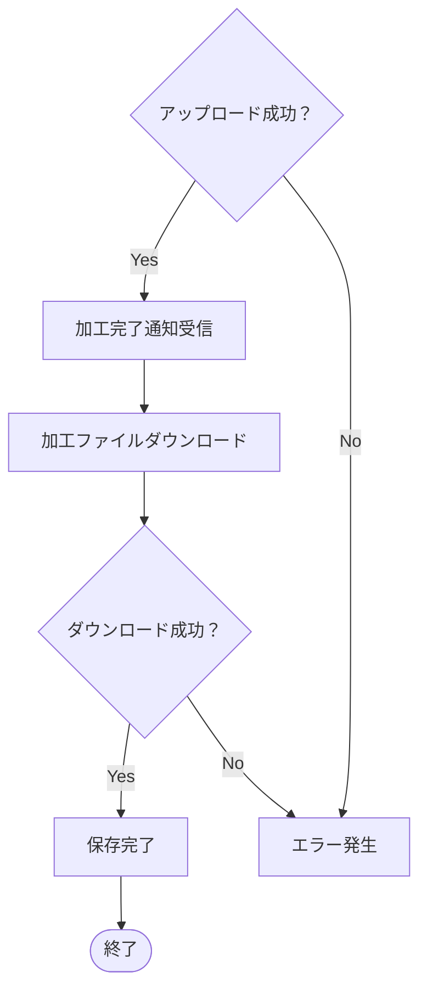

# 🎥 Video-Processor ✨
**TCP通信と独自プロトコル（MMP）で動画ファイルを処理するサービス**

## 🖥 デモ
以下は動画のアスペクト比変更のデモです

https://github.com/user-attachments/assets/be339ad0-1a5b-4105-a610-feef6faf65c7

以下の動画では、上側に変換前、下側に変換後を同時に表示しています

https://github.com/user-attachments/assets/2354d4d1-6439-47c5-88cc-d1e4aeb124a5

---
## **📎 概要**
- [説明](#説明)
- [セットアップ](#セットアップ)
- [利用方法](#利用方法)


## **🛠 技術関連**
- [使用技術](#使用技術)
- [クラス図](#クラス図)
- [処理の流れ](#処理の流れ)


## **📍開発のポイント**
- [こだわりのポイント](#こだわりのポイント)
- [苦労した点](#苦労した点)
- [さらに追加したい機能](#さらに追加したい機能)


## **📄 参考情報**
- [参考文献](#参考文献)

---

## <a id="説明"></a> 📎 説明

このプロジェクトは、PythonとTCPソケット通信を利用した**メディアファイル加工システム**です。  
ファイルのアップロード、動画・音声の変換、GIF作成などのリクエストをリアルタイムで処理し、結果ファイルを即座にクライアントへ返却します。  
**ファイル分割受信・送信**、**ffmpeg連携加工**、**エラーハンドリング**など、実運用を想定した設計が特徴です。

### 主な特徴

- **リアルタイムメディア加工**  
  TCP通信によって、動画・音声・GIFファイルを高速で送受信し、即加工・レスポンス。

- **多彩な加工機能**  
  動画圧縮・解像度変更・アスペクト比変更・音声抽出・GIF生成など、豊富な加工オプションに対応。

- **堅牢なファイル通信**  
  チャンク単位の送受信で、大容量ファイルにも対応しつつ、安定した通信を実現。

- **加工履歴ログ出力**  
  各加工工程を詳細ログとして出力し、エラー発生時も素早くトラブルシュート可能。

- **ユーザーフレンドリーな操作**  
  クライアント側でファイル選択・オプション指定を対話式で進行。初心者にも扱いやすい設計。

- **エラーハンドリング & 再送制御**  
  通信エラーや加工失敗時は専用エラーメッセージを返却し、クライアント側で適切に終了・通知。

---

## <a id="セットアップ"></a> 🚀 セットアップ

### 1. 前提条件

- **Python 3.8以上**  
  [Python公式サイト](https://www.python.org/downloads/) からインストールできます。

- **Git**  
  [Git公式サイト](https://git-scm.com/) からインストールできます。

- **ffmpeg**  
  [ffmpeg公式サイト](https://ffmpeg.org/download.html) からインストールできます


### 2. リポジトリのクローン

以下のコマンドを使って、このプロジェクトのコードをローカルに取得します：

```bash
git clone https://github.com/BackendExplorer/Video-Processor.git
```
```bash
cd Video-Processor
```

---

## <a id="使い方"></a>▶️ 使い方

### 1. サーバ起動

サーバスクリプトを実行し、クライアントからのファイルアップロードと加工リクエストを待機します。

```bash
python3 server.py
```
サーバは接続された複数のクライアントとのやりとりを同時に処理します。

### 2. クライアント起動
別のターミナルを開き、以下のコマンドでクライアントを起動します。

```bash
python3 client.py
```
クライアントを複数起動すれば、同時に複数ファイルのアップロード・加工依頼をテストすることができます。


---


## <a id="使用技術"></a>🛠 使用技術

| カテゴリ       | 技術スタック                                                                 |
|----------------|------------------------------------------------------------------------------|
| 開発言語       | Python 3.8以上<br>（標準ライブラリ使用：`socket`, `os`, `json`, `logging`, `pathlib`, `sys`, `re`） |
| 通信技術       | TCPソケット通信によるファイル送受信<br>カスタムヘッダー設計によるメタデータ管理 |
| メディア加工   | `ffmpeg` ライブラリをPythonから呼び出して動画・音声処理 |
| 開発環境       | macOS  ・ VSCode                               |
| バージョン管理 | Git（バージョン管理）・GitHub（コード共有・公開）                          |
| 描画ツール     | Mermaid （必要に応じてシーケンス図など作成） |

### 技術選定の理由

- **Python**  
  シンプルな構文と豊富な標準ライブラリにより、ネットワーク通信やファイル処理を素早く実装可能なため採用しました。

- **socket通信（TCP）**  
  ファイルアップロード・ダウンロードにおいて、データの信頼性と順序保証が必須であったため、TCP通信を採用しました。

- **ffmpegライブラリ**  
  高性能かつ多機能なメディア加工エンジンであり、Pythonから簡単に呼び出し可能なため選定しました。  
  これにより、動画圧縮・解像度変更・音声抽出・GIF作成といった多様なニーズに柔軟に対応できます。

- **標準ライブラリ（os, json, pathlib, logging, sys, re）**  
  追加ライブラリ不要で、システム制御、ファイル管理、エラーハンドリング、データ構造化が完結できるため選択しました。


---

<div style="font-size:120%; line-height:1.6;">
  
## <a id="処理の流れ"></a>🔀処理の流れ


### フローチャート
以下は、このアプリの基本的な操作フローです

### フローチャート（ユーザー操作視点）




---

## <a id="クラス図"></a>📦 クラス図と構成


### <a id="server.py のクラス図"></a> 

---
## <a id="こだわりのポイント"></a> ✨ こだわりのポイント

---
## <a id="苦労した点"></a> ⚠️ 苦労した点


---

## <a id="さらに追加したい機能"></a> 🌱 さらに追加したい機能


---
## <a id="参考文献"></a>📄 参考文献

### 公式ドキュメント


### 参考にしたサイト

